# Cloud-IAM-Optimizer


**AWS/GCP IAM Least Privilege Auditor**

Cloud-IAM-Optimizer is a powerful tool designed to audit your cloud infrastructure's Identity and Access Management (IAM) configurations. It helps you identify over-privileged accounts and enforce the principle of least privilege across AWS and GCP environments.

**Commercial Brand:** [run-as-daemon.dev](https://run-as-daemon.dev)

## Architecture

```mermaid
graph LR
    %% Стилизация узлов
    classDef user fill:#f9f,stroke:#333,stroke-width:2px;
    classDef cloud fill:#dbeafe,stroke:#3b82f6,stroke-width:2px;
    classDef secure fill:#dcfce7,stroke:#22c55e,stroke-width:2px;
    classDef infra fill:#f3f4f6,stroke:#333,stroke-width:1px,stroke-dasharray: 5 5;

    Client([👤 Client / CTO]):::user
    
    subgraph "Public Internet"
        CF["☁️ Cloudflare Edge<br/>(DDoS Protection & SSL)"]:::cloud
    end

    subgraph "Secure Tunnel"
        Tunnel["🚇 CF Tunnel<br/>(No Open Ports)"]:::secure
    end

    subgraph "Private Infrastructure"
        direction TB
        Nginx[🦁 Nginx / VitePress]:::infra
        Dashboard[📊 Grafana / Kuma]:::infra
    end

    %% Связи
    Client -->|HTTPS/443| CF
    CF -->|Zero Trust| Tunnel
    Tunnel -->|Localhost| Nginx
    Tunnel -.->|Internal| Dashboard

    %% Примечание (Link)
    click CF "https://www.cloudflare.com/" "Provider"
```




## Features

- **Multi-Cloud Support:** Audit both AWS and GCP IAM policies.
- **Least Privilege Analysis:** Identify unused permissions and risky configurations.
- **Flexible Output:** Generate reports in JSON or human-readable text formats.
- **CLI Interface:** Easy-to-use command-line interface for integration into CI/CD pipelines.

## Quick Start

### ⚡ 5-Second Audit (MVP)

Run this to find security holes in 5 seconds (requires configured AWS credentials):

```bash
python audit.py
```

### Full CLI Tool


1.  **Clone the repository:**
    ```bash
    git clone https://github.com/ranas-mukminov/Cloud-IAM-Optimizer.git
    cd Cloud-IAM-Optimizer
    ```

2.  **Install dependencies:**
    ```bash
    pip install -r requirements.txt
    ```

3.  **Run an audit:**
    ```bash
    python src/main.py audit --provider aws --output text
    ```

## Usage

```bash
Usage: main.py audit [OPTIONS]

  Run an IAM audit for the specified provider.

Options:
  --provider [aws|gcp]  Cloud provider to audit.  [required]
  --output [json|text]  Output format.
  --help                Show this message and exit.
```

## Commercial Support

We offer professional support and auditing services for your cloud infrastructure.

- **Infrastructure Audit:** Comprehensive security and performance analysis.
- **Monitoring & Backup:** Implementation of robust monitoring and backup solutions.
- **DevOps/SRE Support:** Ongoing support for your development and operations teams.

For commercial inquiries and support, please visit: **[run-as-daemon.dev](https://run-as-daemon.dev)**

> [!NOTE]
> For Russian Federation compliance inquiries, please visit our local mirror: [run-as-daemon.ru](https://run-as-daemon.ru)

## Privacy & Compliance

This tool is designed to be run within your own infrastructure. It does not send any data to external servers.

- **Data Collection:** The tool processes IAM data locally to generate reports.
- **Logs:** No sensitive data is logged by default. Ensure you configure your environment to handle logs securely.
- **Compliance:** Users are responsible for ensuring compliance with local regulations (e.g., 152-FZ in Russia) when using this tool in production.

## License

This project is licensed under the MIT License - see the [LICENSE](LICENSE) file for details.

---
Copyright (c) 2025 Ranas Mukminov | [run-as-daemon.dev](https://run-as-daemon.dev)
